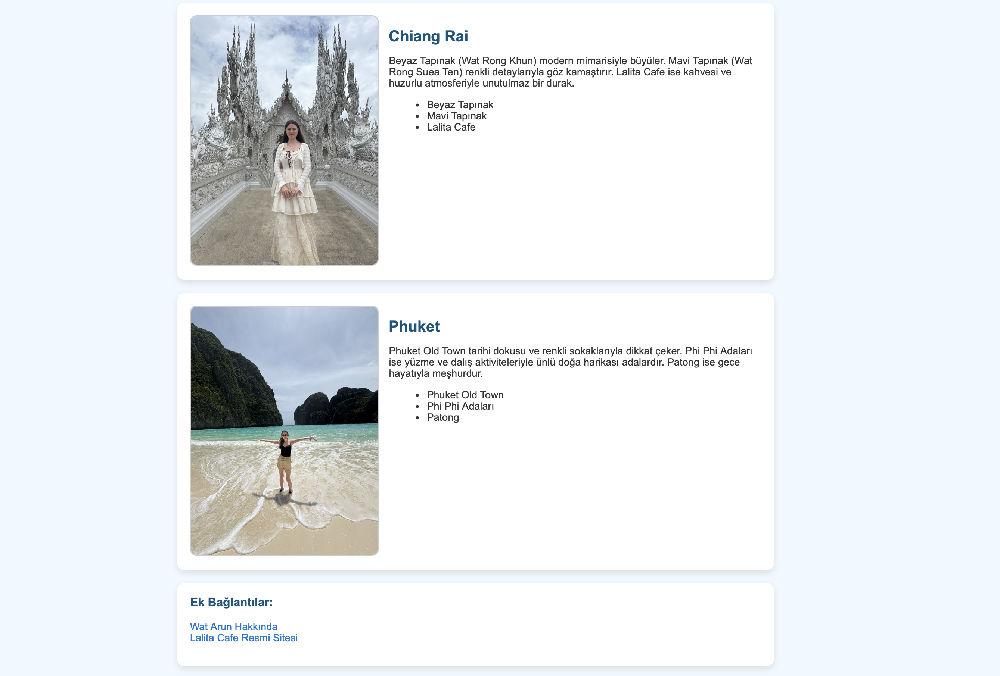

# Kişisel Blog Sayfası: Tayland Gezileri 

Bu proje, HTML ve CSS temel yapılarını kullanarak oluşturulmuş kişisel bir blog sayfasıdır. 
Blog sayfasında başlıklar, paragraflar, sıralı ve sırasız listeler, görseller ve bağlantılar gibi temel HTML öğeleri kullanılmıştır. Amacım, HTML pratik yaparak temel web sayfası yapısını kavramaktır.

...

## 📷 Sayfa Görünümü

Blog sayfasının görünümü:

